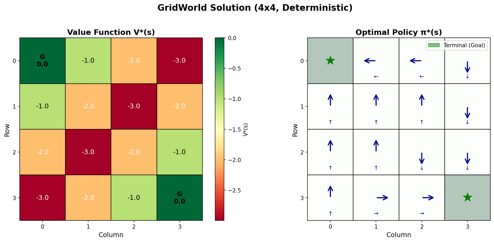
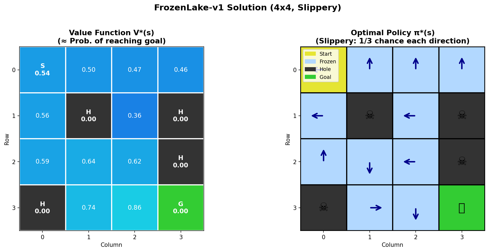
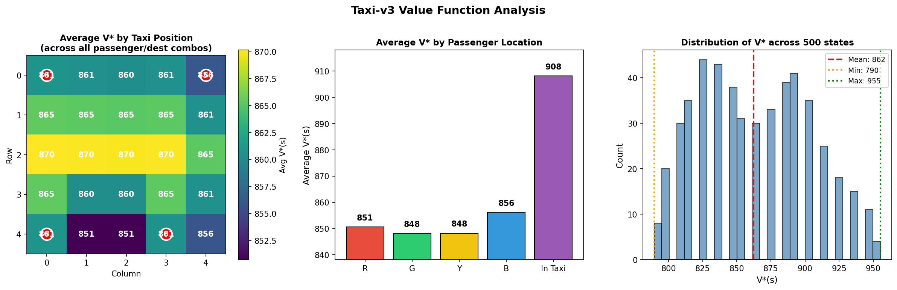
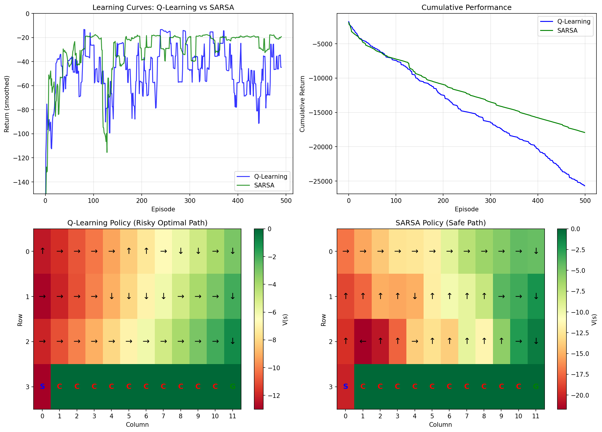
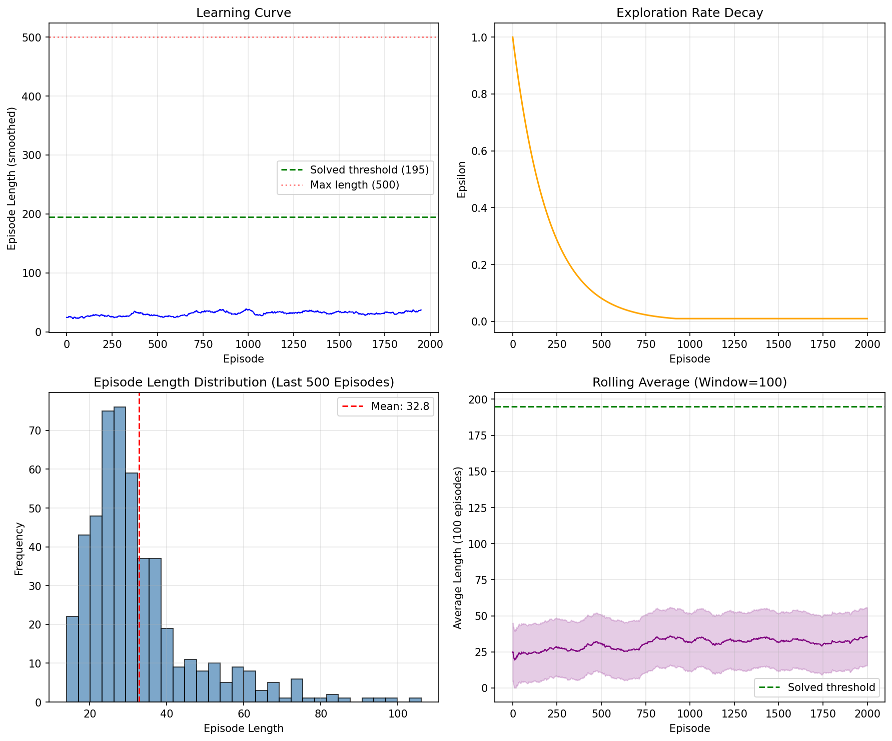
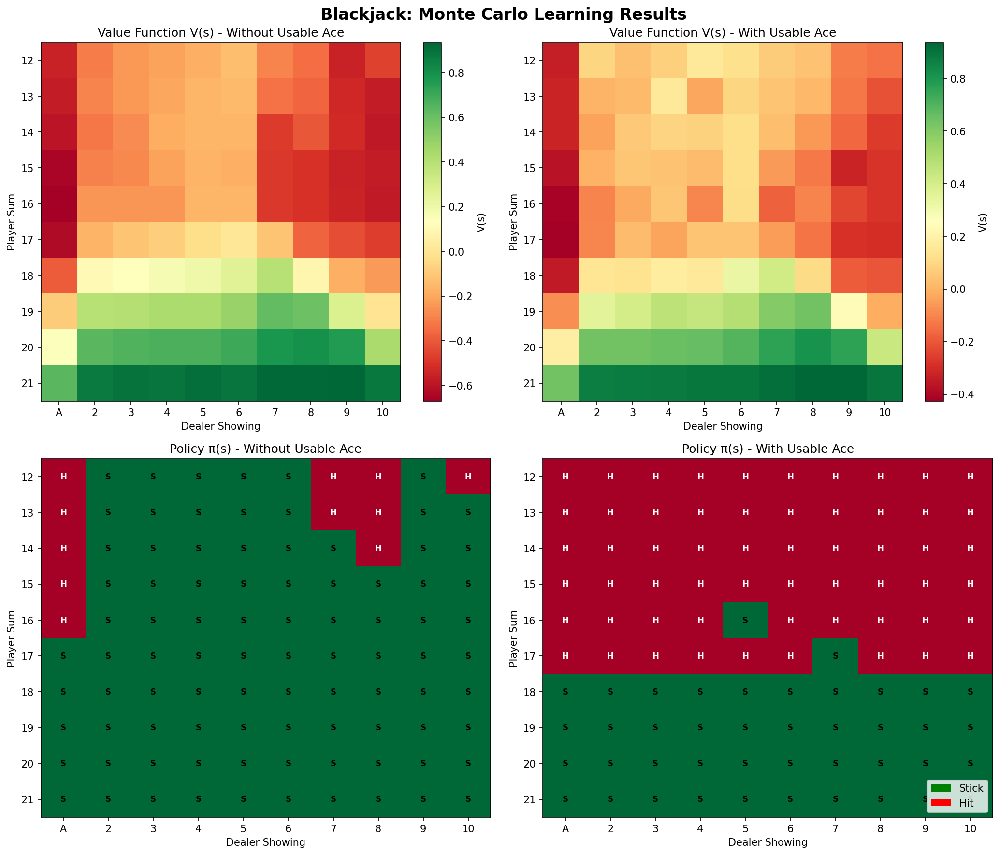
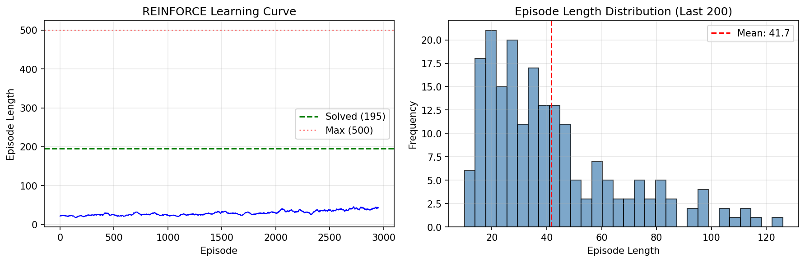

# RL Speedrun 🏃‍♂️💨

> *"Why spend months learning RL when you can mass produce it in days?"* - Me, probably sleep deprived

Welcome to my chaotic journey through Reinforcement Learning. This repo is basically me speedrunning RL concepts, writing everything from scratch, and pretending I know what I'm doing.

## What's This?

A personal RL learning repo where I implement algorithms from first principles. No fancy libraries doing the heavy lifting - just raw NumPy energy and questionable life choices.

## Repository Structure

```
📁 rl_fundamentals/
├── 01_mdp/                  <- MDPs: fancy way to say "states go brrr"
├── 02_value_functions/      <- V(s) and Q(s,a) - the OG value bros
├── 03_bellman_equations/    <- Bellman said: "it's recursive, deal with it"
├── 04_dynamic_programming/  <- When you know everything about the world
├── 05_env_applications/     <- DP in action
│   ├── gridworld/           <- Baby's first MDP
│   ├── frozenlake/          <- Slippery boi simulator
│   └── taxi_v3/             <- Uber but worse
├── 06_temporal_difference/  <- Learning from experience, one step at a time
│   ├── q_learning.py        <- Off-policy TD control
│   └── sarsa.py             <- On-policy TD control
├── 07_td_applications/      <- TD algorithms in the wild
│   ├── cliffwalking/        <- Q-Learning vs SARSA showdown
│   └── cartpole/            <- Discretized Q-Learning
├── 08_monte_carlo/          <- Wait for the episode to end, then learn
│   └── monte_carlo.py       <- First-Visit & Every-Visit MC
├── 09_policy_gradients/     <- Directly optimize the policy
│   └── reinforce.py         <- The OG policy gradient
├── 10_mc_pg_applications/   <- MC & PG in action
│   ├── blackjack/           <- Classic MC territory
│   └── cartpole_reinforce/  <- Neural network policy
├── 11_unified_agent/        <- Modular RL agent framework
│   ├── exploration_strategies.py  <- ε-greedy, Boltzmann, UCB
│   └── unified_agent.py     <- Configurable Q-Learning/SARSA
├── 12_benchmarking/         <- Systematic algorithm comparison
│   └── benchmark.py         <- Multi-algorithm benchmarking
├── 13_dqn_fundamentals/     <- Deep Q-Networks from scratch
│   ├── replay_buffer.py     <- Experience replay
│   ├── target_network.py    <- Stable learning targets
│   └── dqn.py               <- Full DQN implementation
├── 14_dqn_improvements/     <- DQN enhancements
│   └── double_dqn.py        <- Fixing overestimation bias
├── 15_dqn_applications/     <- DQN in the wild
│   ├── cartpole_dqn/        <- CartPole with neural nets
│   └── lunarlander_dqn/     <- Landing rockets with DQN
├── 16_actor_critic/         <- Best of both worlds
│   ├── advantage.py         <- GAE and advantage estimation
│   ├── entropy.py           <- Exploration via entropy bonus
│   └── a2c.py               <- Advantage Actor-Critic
├── 17_actor_critic_applications/  <- A2C in action
│   ├── cartpole_a2c/        <- A2C vs DQN vs REINFORCE
│   └── lunarlander_a2c/     <- Landing rockets, actor-critic style
├── 18_ppo/                  <- The algorithm that made RL practical
│   └── ppo.py               <- PPO with clipping (discrete + continuous)
├── 19_ppo_applications/     <- PPO in the wild
│   ├── lunarlander_ppo/     <- Stable lunar landing
│   └── bipedal_walker_ppo/  <- Teaching a robot to walk
├── 20_trpo/                 <- PPO's predecessor (second-order optimization)
│   └── trpo.py              <- TRPO: conjugate gradient + line search
├── 21_ddpg/                 <- Off-policy continuous control
│   └── ddpg.py              <- DDPG: deterministic policy + replay buffer
├── 22_td3/                  <- Fixing DDPG's failure modes
│   └── td3.py               <- TD3: twin critics, delayed updates, smoothing
├── 23_offpolicy_applications/  <- Off-policy algorithms in the wild
│   ├── pendulum_ddpg/       <- Swing up with deterministic policy
│   ├── pendulum_td3/        <- Swing up, twin critic edition
│   └── bipedal_walker_td3/  <- Teaching a robot to walk (off-policy)
├── 24_mcts/                 <- Monte Carlo Tree Search from scratch
│   └── mcts.py              <- UCB1 selection + random rollouts
├── 25_alphazero/            <- Self-play with neural network MCTS
│   ├── games.py             <- TicTacToe + Connect Four
│   └── alphazero.py         <- PolicyValueNet + PUCT + self-play
├── 26_muzero/               <- Planning without knowing the rules
│   └── muzero.py            <- Learned dynamics + latent MCTS
└── 27_game_applications/    <- Game AI in the wild
    ├── tictactoe_mcts/      <- Pure MCTS achieves perfect play
    ├── tictactoe_alphazero/  <- AlphaZero learns TicTacToe
    ├── connect4_alphazero/   <- AlphaZero on Connect Four
    └── tictactoe_muzero/    <- MuZero: no rules needed
```

---

## Week 1: Dynamic Programming

*"When you have God mode enabled (full model knowledge)"*

### GridWorld - The Classic
<p align="center">
  
</p>

*Optimal policy for a 4x4 grid. Terminal states at corners. Agent just wants to go home.*

### FrozenLake - Slippery When Wet
<p align="center">
  
</p>

*That feeling when you try to go right but physics says "nah". 1/3 chance of actually going where you want.*

### Taxi-v3 - 500 States of Pain
<p align="center">
  
</p>

*Value function heatmap. Higher = closer to dropping off passengers and escaping this nightmare.*

---

## Week 2: Temporal Difference Learning

*"Model-free vibes - learning from experience without knowing the rules"*

### CliffWalking - The Q-Learning vs SARSA Showdown
<p align="center">
  
</p>

*Q-Learning: "I'll walk the edge, YOLO"*
*SARSA: "I'd rather live, thanks"*

The classic demonstration of off-policy vs on-policy learning:
- **Q-Learning** finds the risky optimal path (right along the cliff edge)
- **SARSA** finds the safer path (stays away from the cliff because it knows it might slip)

### CartPole - Discretization Station
<p align="center">
  
</p>

*Continuous state space? Just chop it into bins and pretend it's discrete.*

---

## Week 3: Monte Carlo & Policy Gradients

*"Episode-based learning meets direct policy optimization"*

### Blackjack - Monte Carlo Territory
<p align="center">
  
</p>

*Learning to play 21 by sampling complete games. The house still wins, but less often.*

Monte Carlo methods wait for the episode to end, then learn from actual returns:
- **First-Visit MC**: Only count the first visit to each state
- **Every-Visit MC**: Count all visits (lower variance)

### CartPole REINFORCE - Neural Network Policy
<p align="center">
  
</p>

*Direct policy optimization: no value function needed, just gradients and vibes.*

REINFORCE directly optimizes the policy using the policy gradient theorem:
$$\nabla J(\theta) = \mathbb{E}[\nabla \log \pi_\theta(a|s) \cdot G_t]$$

---

## Week 4: Unified Agents & Benchmarking

*"Time to get organized and systematic"*

### Exploration Strategies
Implemented modular exploration strategies:
- **ε-greedy**: Classic random exploration
- **Boltzmann/Softmax**: Temperature-based action selection
- **UCB (Upper Confidence Bound)**: Optimism in the face of uncertainty

### Benchmarking Framework
Systematic comparison of algorithms across environments with statistical rigor.

---

## Week 5: Deep Q-Networks (DQN)

*"When tabular methods hit their limits, neural networks enter the chat"*

### The DQN Revolution
Pure NumPy implementation of DQN with:
- **Experience Replay**: Break correlation, reuse data
- **Target Networks**: Stable learning targets
- **Double DQN**: Fix overestimation bias

```
┌─────────────────────────────────────────────────────────────┐
│                   DQN Architecture                          │
├─────────────────────────────────────────────────────────────┤
│   State → [Hidden 64] → [Hidden 64] → Q-values             │
│                                                             │
│   Key Innovations:                                          │
│   1. Experience Replay Buffer                               │
│   2. Target Network (updated every C steps)                 │
│   3. Double DQN (decouple selection from evaluation)        │
└─────────────────────────────────────────────────────────────┘
```

### CartPole & LunarLander with DQN
Solving classic control problems with neural network function approximation.

---

## Week 6: Actor-Critic Methods (A2C)

*"Why choose between policy gradients and value functions when you can have both?"*

### Advantage Actor-Critic
Combines the best of both worlds:
- **Actor**: Policy network π(a|s) - what to do
- **Critic**: Value network V(s) - how good is this state

```
                        ┌─────────────────┐
                        │   Environment   │
                        └────────┬────────┘
                                 │
                        state s, reward r
                                 │
         ┌───────────────────────┼───────────────────────┐
         │                       │                       │
         ▼                       │                       ▼
   ┌──────────┐                  │                ┌──────────┐
   │  ACTOR   │                  │                │  CRITIC  │
   │  π(a|s)  │◄─── Advantage ───┤                │   V(s)   │
   └──────────┘    A = Q - V     │                └──────────┘
         │                       │                       │
         ▼                       │                       ▼
      action a               gradient                baseline
```

### Key Components
- **GAE (Generalized Advantage Estimation)**: Tunable bias-variance tradeoff
- **Entropy Regularization**: Prevent premature convergence
- **Shared Feature Layers**: Parameter efficient actor-critic

---

## Week 7: Proximal Policy Optimization (PPO)

*"The algorithm that made deep RL actually practical"*

### The Clipped Surrogate Objective

PPO takes A2C and adds one powerful constraint: **don't let the policy change too much in a single update**.

$$L^{CLIP}(\theta) = \hat{\mathbb{E}}_t\left[\min\left(r_t(\theta) \hat{A}_t, \; \text{clip}(r_t(\theta), 1-\epsilon, 1+\epsilon) \hat{A}_t\right)\right]$$

where $r_t(\theta) = \frac{\pi_\theta(a_t|s_t)}{\pi_{\theta_{old}}(a_t|s_t)}$ is the probability ratio.

```
┌─────────────────────────────────────────────────────────────┐
│                   PPO: A2C with Guardrails                   │
├─────────────────────────────────────────────────────────────┤
│                                                              │
│   Collect rollout → Compute GAE advantages                   │
│                          ↓                                   │
│         ┌─── For K epochs (reuse data!) ───┐                │
│         │  Shuffle into mini-batches        │                │
│         │  ratio = π_new / π_old            │                │
│         │  clip(ratio, 1-ε, 1+ε)           │                │
│         │  Take pessimistic (min) update    │                │
│         └───────────────────────────────────┘                │
│                                                              │
│   Key insight: clipping prevents catastrophic policy updates │
└─────────────────────────────────────────────────────────────┘
```

### LunarLander & BipedalWalker with PPO
- **LunarLander**: Discrete actions (4), PPO's stability shines on this harder control task
- **BipedalWalker**: Continuous actions (4D Gaussian policy), teaching a robot to walk

---

## Week 9: TRPO, DDPG & TD3

*"Trust regions, deterministic policies, and twin critics"*

### TRPO — PPO's Predecessor

Uses a **hard KL divergence constraint** enforced via conjugate gradient + line search:

$$\max_\theta L(\theta) \quad \text{s.t.} \quad D_{KL}(\pi_{old} \| \pi_{new}) \leq \delta$$

The natural gradient update: $\theta_{new} = \theta + \sqrt{2\delta / g^T F^{-1} g} \cdot F^{-1} g$

### DDPG & TD3 — Off-Policy Continuous Control

```
┌─────────────────────────────────────────────────────────────┐
│              DDPG → TD3: Continuous Control Pipeline          │
├─────────────────────────────────────────────────────────────┤
│                                                              │
│   DDPG: DQN ideas + Actor-Critic for continuous actions      │
│     state → [Actor μ(s)] → action → [Critic Q(s,a)] → value │
│     + Replay buffer + Target networks + Exploration noise    │
│                                                              │
│   TD3 fixes DDPG's three problems:                           │
│     1. Twin critics: min(Q1, Q2) → no overestimation        │
│     2. Delayed updates: actor every 2 critic steps           │
│     3. Target smoothing: noise on target actions             │
│                                                              │
└─────────────────────────────────────────────────────────────┘
```

### Environments
- **CartPole**: TRPO with natural gradient (discrete)
- **Pendulum**: DDPG and TD3 comparison (continuous, 1D action)
- **BipedalWalker**: TD3 on hard 4D continuous control

---

## Week 10: Game AI — MCTS, AlphaZero & MuZero

*"From random rollouts to learning without rules"*

### The Evolution: MCTS → AlphaZero → MuZero

```
┌─────────────────────────────────────────────────────────────┐
│                Game AI: Three Generations                     │
├─────────────────────────────────────────────────────────────┤
│                                                              │
│  MCTS (2006):  UCB1 selection + random rollouts              │
│       ↓        No learning, just search                      │
│  AlphaZero (2017): MCTS + neural network (policy + value)   │
│       ↓        Self-play learns from scratch                 │
│  MuZero (2020): MCTS + learned model (no game rules!)       │
│                Plans in a learned latent space                │
│                                                              │
│  Key insight: each generation replaces handcrafted           │
│  components with learned ones                                │
│                                                              │
└─────────────────────────────────────────────────────────────┘
```

### Results

| Algorithm | Game | Win Rate vs Random |
|-----------|------|--------------------|
| **MCTS** (1000 sims) | TicTacToe | ~99% |
| **AlphaZero** (80 iters) | TicTacToe | ~97% |
| **AlphaZero** (100 iters) | Connect Four | ~98% |
| **MuZero** (80 iters) | TicTacToe | ~72% |

MuZero achieves lower win rates than AlphaZero because it must also learn the game dynamics from scratch.

---

## Quick Start

```bash
# Install the goods
pip install -r rl_fundamentals/requirements.txt

# === Week 1: Dynamic Programming ===
python rl_fundamentals/05_env_applications/gridworld/gridworld_dp.py
python rl_fundamentals/05_env_applications/frozenlake/solve_frozenlake.py
python rl_fundamentals/05_env_applications/taxi_v3/solve_taxi.py

# === Week 2: Temporal Difference ===
python rl_fundamentals/07_td_applications/cliffwalking/solve_cliffwalking.py
python rl_fundamentals/07_td_applications/cartpole/solve_cartpole.py

# === Week 3: Monte Carlo & Policy Gradients ===
python rl_fundamentals/10_mc_pg_applications/blackjack/solve_blackjack.py
python rl_fundamentals/10_mc_pg_applications/cartpole_reinforce/solve_cartpole_reinforce.py

# === Week 4: Unified Agent & Benchmarking ===
python rl_fundamentals/11_unified_agent/exploration_strategies.py
python rl_fundamentals/12_benchmarking/benchmark.py

# === Week 5: Deep Q-Networks ===
python rl_fundamentals/13_dqn_fundamentals/dqn.py
python rl_fundamentals/14_dqn_improvements/double_dqn.py
python rl_fundamentals/15_dqn_applications/cartpole_dqn/solve_cartpole_dqn.py

# === Week 6: Actor-Critic ===
python rl_fundamentals/16_actor_critic/a2c.py
python rl_fundamentals/17_actor_critic_applications/cartpole_a2c/solve_cartpole_a2c.py

# === Week 7: PPO ===
python rl_fundamentals/18_ppo/ppo.py
python rl_fundamentals/19_ppo_applications/lunarlander_ppo/solve_lunarlander_ppo.py
python rl_fundamentals/19_ppo_applications/bipedal_walker_ppo/solve_bipedal_walker_ppo.py

# === Week 9: TRPO, DDPG & TD3 ===
python rl_fundamentals/20_trpo/trpo.py
python rl_fundamentals/21_ddpg/ddpg.py
python rl_fundamentals/22_td3/td3.py
python rl_fundamentals/23_offpolicy_applications/pendulum_ddpg/solve_pendulum_ddpg.py
python rl_fundamentals/23_offpolicy_applications/pendulum_td3/solve_pendulum_td3.py
python rl_fundamentals/23_offpolicy_applications/bipedal_walker_td3/solve_bipedal_walker_td3.py

# === Week 10: Game AI ===
python rl_fundamentals/24_mcts/mcts.py
python rl_fundamentals/25_alphazero/alphazero.py
python rl_fundamentals/26_muzero/muzero.py
python rl_fundamentals/27_game_applications/tictactoe_mcts/solve_tictactoe_mcts.py
python rl_fundamentals/27_game_applications/tictactoe_alphazero/solve_tictactoe_alphazero.py
python rl_fundamentals/27_game_applications/connect4_alphazero/solve_connect4_alphazero.py
python rl_fundamentals/27_game_applications/tictactoe_muzero/solve_tictactoe_muzero.py
```

---

## Speedrun Progress

- [x] **Week 1: Dynamic Programming** - When you have the cheat codes (full model)
- [x] **Week 2: Temporal Difference** - Q-Learning & SARSA (model-free vibes)
- [x] **Week 3: Monte Carlo & Policy Gradients** - Episode-based learning
- [x] **Week 4: Unified Agents** - Modular exploration & benchmarking
- [x] **Week 5: Deep Q-Networks** - Neural nets + experience replay + target networks
- [x] **Week 6: Actor-Critic** - Best of policy gradients + value functions
- [x] **Week 7: PPO** - Clipped surrogate, stable updates, discrete + continuous
- [x] **Week 9: TRPO, DDPG & TD3** - Trust regions, off-policy continuous control
- [x] **Week 10: Game AI** - MCTS, AlphaZero self-play, MuZero learned model
- [ ] **Week 11+: Research Immersion** - Paper reading, SAC, and beyond...

---

## The Algorithms

### Week 1: Dynamic Programming (Model-Based)

| Algorithm | Update Rule | Requires Model? |
|-----------|-------------|-----------------|
| **Value Iteration** | V(s) ← max_a Σ P(s'\|s,a)[R + γV(s')] | Yes |
| **Policy Iteration** | Evaluate → Improve → Repeat | Yes |

### Week 2: Temporal Difference (Model-Free, Bootstrapping)

| Algorithm | Update Rule | Policy Type |
|-----------|-------------|-------------|
| **Q-Learning** | Q(S,A) ← Q(S,A) + α[R + γ·max_a Q(S',a) - Q(S,A)] | Off-policy |
| **SARSA** | Q(S,A) ← Q(S,A) + α[R + γQ(S',A') - Q(S,A)] | On-policy |

### Week 3: Monte Carlo & Policy Gradients

| Algorithm | Update Rule | Key Property |
|-----------|-------------|--------------|
| **MC Prediction** | V(s) ← V(s) + α[G_t - V(s)] | Unbiased, high variance |
| **REINFORCE** | θ ← θ + α·G_t·∇log π(a\|s) | Direct policy optimization |

### Week 5: Deep Q-Networks

| Algorithm | Key Innovation | Benefit |
|-----------|----------------|---------|
| **DQN** | Experience Replay + Target Network | Stable deep RL |
| **Double DQN** | Decouple selection from evaluation | Reduce overestimation |

### Week 6: Actor-Critic

| Algorithm | Components | Benefit |
|-----------|------------|---------|
| **A2C** | Actor π(a\|s) + Critic V(s) | Lower variance than REINFORCE |
| **GAE** | λ-weighted TD errors | Tunable bias-variance |

### Week 7: Proximal Policy Optimization

| Algorithm | Key Innovation | Benefit |
|-----------|----------------|---------|
| **PPO** | Clipped surrogate ratio | Stable policy updates, multi-epoch reuse |

### Week 9: TRPO, DDPG & TD3

| Algorithm | Key Innovation | Benefit |
|-----------|----------------|---------|
| **TRPO** | KL-constrained natural gradient | Monotonic improvement guarantee |
| **DDPG** | Deterministic policy + replay | Off-policy continuous control |
| **TD3** | Twin critics + delayed + smoothing | Robust continuous control |

### Week 10: Game AI

| Algorithm | Key Innovation | Benefit |
|-----------|----------------|---------|
| **MCTS** | UCB1 tree search + random rollouts | Strong play without learning |
| **AlphaZero** | MCTS + policy-value network + self-play | Learns from scratch, superhuman |
| **MuZero** | Learned dynamics model + latent MCTS | No game rules needed |

---

## Method Comparison

| Method | Bootstraps? | Model-Free? | Episode End? | Bias | Variance |
|--------|-------------|-------------|--------------|------|----------|
| **DP** | Yes | No | N/A | Low | Low |
| **TD** | Yes | Yes | No | Some | Medium |
| **MC** | No | Yes | Yes | None | High |
| **PG** | No | Yes | Yes | None | Very High |
| **DQN** | Yes | Yes | No | Some | Low |
| **A2C** | Yes (GAE) | Yes | No | Tunable | Medium |
| **PPO** | Yes (GAE) | Yes | No | Tunable | Low |
| **TRPO** | Yes (GAE) | Yes | No | Tunable | Low |
| **DDPG** | Yes | Yes | No | Some | Low |
| **TD3** | Yes | Yes | No | Low | Low |
| **MCTS** | No | Yes | No | None | High |
| **AlphaZero** | No | Yes | No | Some | Low |
| **MuZero** | Yes | Yes | No | Some | Medium |

---

## Philosophy

This repo follows the ancient wisdom:

1. **Understand the math** - Actually derive things, no hand-waving
2. **Implement from scratch** - Suffering builds character
3. **Visualize everything** - Pretty pictures > walls of numbers
4. **Keep it real** - Comments are for future confused me

---

## Resources I'm Stealing From

- Sutton & Barto's RL Book (the bible)
- David Silver's lectures (goated)
- OpenAI Spinning Up (documentation supremacy)
- Stack Overflow (no shame)

---

*Currently speedrunning: MCTS, AlphaZero & MuZero* ✓

*Next up: Research immersion — paper reading & implementation!*

**Stars appreciated, issues tolerated, PRs celebrated** ⭐
